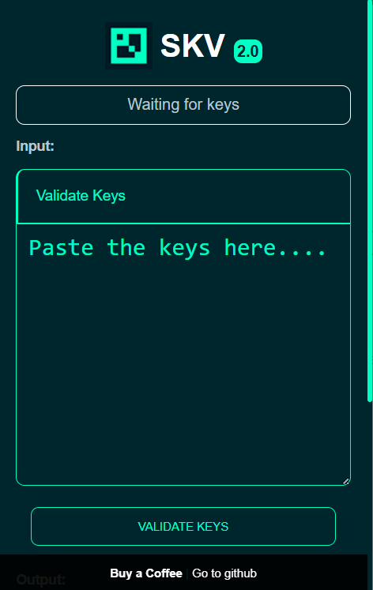

# STEAM-KEYS-VALIDATOR (V1)

Validate multiple steam keys and generate txt files with the keys that have not been used and those that were used.

#### Personal note
* This project was created on a night of sleeplessness, has an unpredictable error of error and depends on the loading speed of the partner.steamgames.com page, the code is barely functional and maybe it was not written in the best way, but It fulfills its purpose.
* Only steam game developers should use this code, I do not recommend validating many keys at once and I am not responsible if you violate any valve norm, use it at your own risk.
* Validate the keys several times or manually to be sure.
* No, it has no virus, and I will not steal your keys, check the code is completely clean.

### Screenshots
Popup
:-------------------------:

# Changelog
### v1
* First version maybe the last
   * validate and divide the used keys from those not and generate .txt files.

# Problems
* Sometimes the partner.steamgames.com page does not load fast and the keys have a repeated value to the previous one.
* The textarea and a counter appears a repeated key and a number of more but when creating the files everything is fine.
* Do not save data, if you close the popup before everything is deleted, make sure you finish validating the keys and generating the files before closing the popup.
* For the same reason of the previous point, nothing else can be done in the browser until all the validations are finished, If you want to feel smart, better use: https://gist.github.com/Jimbly/9f6c6a0d9414310347f2803902ac7bb7 for Jimbly.

# Install
* Download the STEAM-KEYS-VALIDATOR.crx file that is in the compiledextension folder and drag it to your explorer, that's it.
* If you want to modify the extension, contribute or improve the code, you can download the SteamKeysValidator folder and open your browser and install.

# Questions
* Should I install a library to use? No, you just have to install the extension and go.
* What license do you have? GNU General Public License
* compatibility? I tried it on opera gx, in theory it should work with any chromium-based browser.

# Contact
* My Website: https://www.nezosgames.com
* Buy a game?: 
   * Steam: https://store.steampowered.com/search/?developer=NEZOS%20GAMES 
   * itch.io: https://nezosgames.itch.io
* @Avarozdev in twitter.
